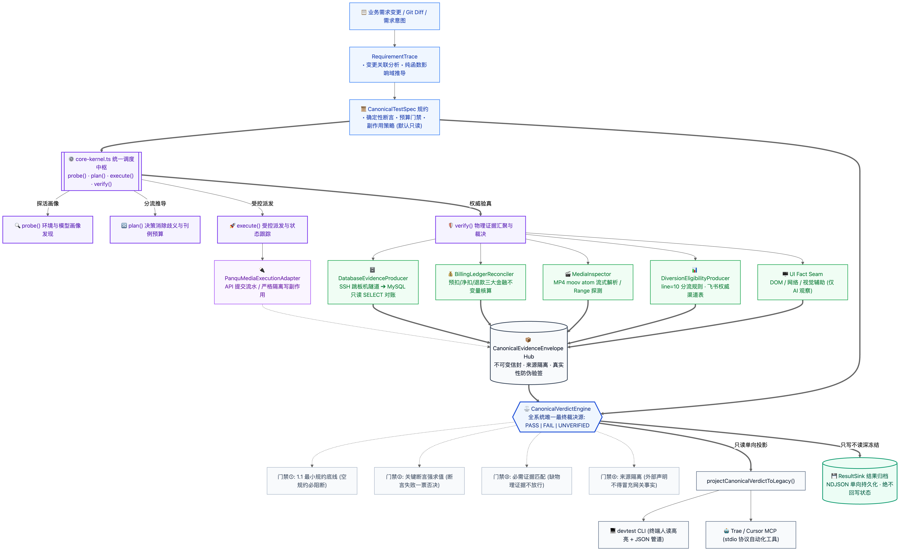
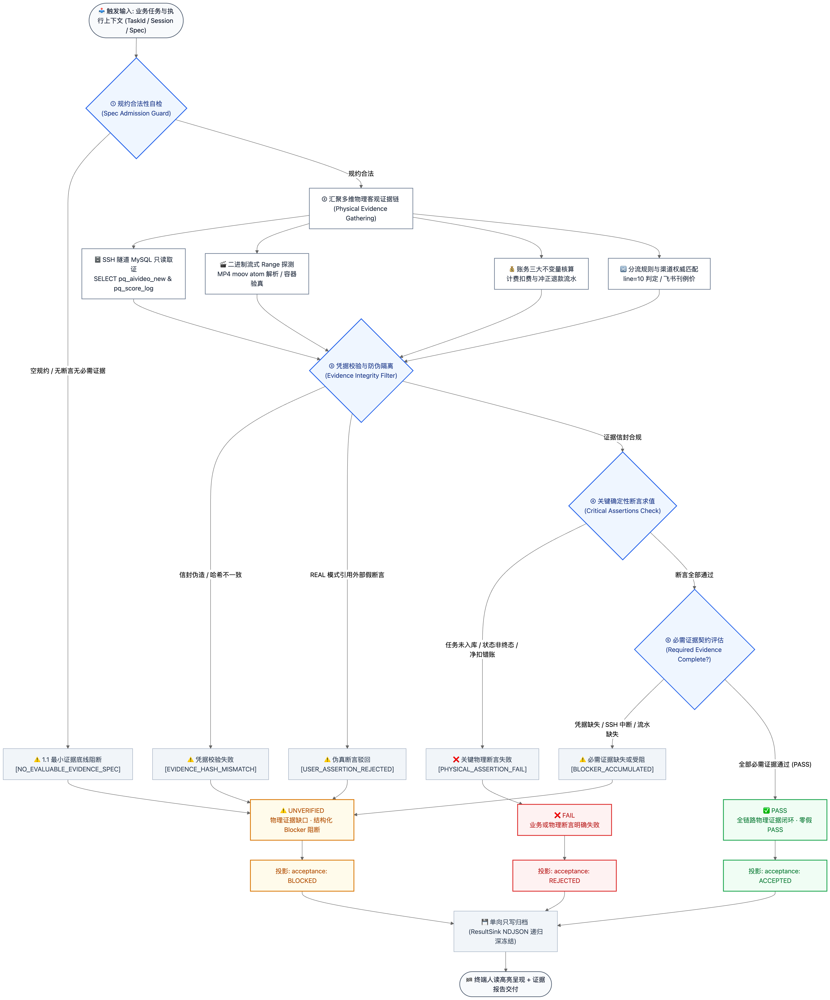
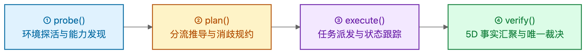
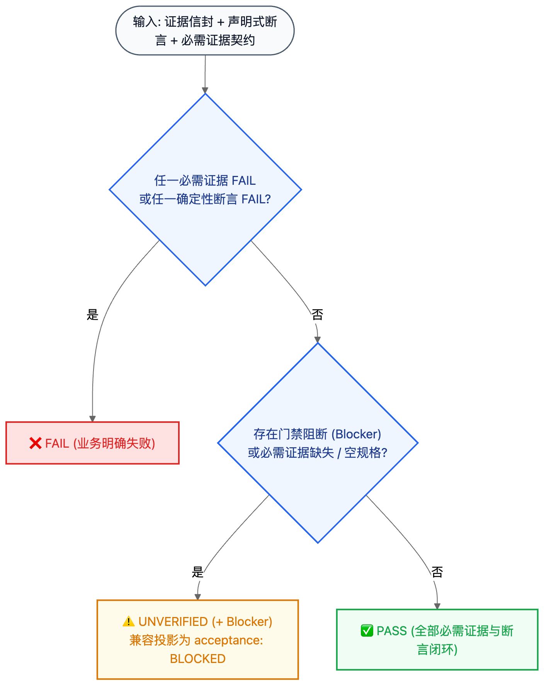

<div align="center">

# 🛡️ Ai-DevTest

**面向 AI 图片与视频生成链路的自动化测试工具**

[](package.json)
[-brightgreen.svg)](tests/unit/devtest)
[%20%7C%2086.51%25%20(Stmts)-brightgreen.svg)](vitest.config.ts)
[](.github/workflows/ci.yml)
[](package.json)
[](package.json)
[-purple.svg)](docs/ARCHITECTURE_FREEZE.md)
[](docs/CLI_REFERENCE.md)

</div>

---

## 📖 项目简介

Ai-DevTest 是一个专为 AI 图片与视频生成链路打造的自动化测试工具。它主要负责**测试任务提交、生成文件校验、数据库记录核对与积分流水对账**，不包含模型训练与推理。

> **核心流程：提交测试任务 ➔ 查数据库落库 ➔ 校验生成文件 ➔ 核对积分流水**

> [!IMPORTANT]
> **统一判定结果**：测试结果统一为 `PASS`（通过）、`FAIL`（失败）或 `UNVERIFIED`（未验证/证据不足），不依赖接口 HTTP 200 单独判断。

---

## 🏛️ 系统架构

整体执行流程为：**测试配置（Spec） ➔ 收集证据（Evidence） ➔ 判定结果（Verdict） ➔ 输出报告（Projection）**：



---

## 🏗️ 代码分层说明

代码结构分为 4 个层次，层级之间单向依赖：

| 层级 | 主要模块 | 说明 | 依赖规则 |
|---|---|---|---|
| **Tier 1: 核心链路** | `canonical-protocol.ts`<br>`core-kernel.ts`<br>`canonical-verdict-engine.ts`<br>`database-evidence-producer.ts` | 负责核心测试流程、任务派发与最终结果判定。 | 基础核心代码，无外部重型依赖，不允许循环引用。 |
| **Tier 2: 功能扩展** | `result-sink.ts`<br>`ui-adapters.ts`<br>`agent-evaluation.ts`<br>`exploration/` | 测试结果导出、UI 辅助检查、评测扩展。 | 可插拔，不影响主干执行。 |
| **Tier 3: 本地测试** | `TestOfflineExecutionAdapter`<br>`UIFixtureExecutionAdapter`<br>`tests/fixtures/` | 离线模拟、测试数据与单元测试。 | 仅限 `tests/` 目录，不打包到生产代码。 |
| **Tier 4: 规范参考** | 外部工具与规范适配 | 规范适配与轻量类型定义。 | 仅保留轻量接口定义，不引入重型第三方依赖。 |

---

## 🔄 测试执行与状态判定

测试执行过程与判定流转如下，必须拿到足够的证据才会判定通过：



---

## 🎛️ 核心测试命令



- **`probe`**：检查测试环境连通性，验证 API 凭证与支持的模型列表。（使用 `--mock` 为离线模拟，测试报告会标注 `[MOCK]`）
- **`plan`**：根据模型和渠道确定直连或 NewAPI 分流，预估消耗积分并生成测试计划。
- **`execute`**：执行任务。支持离线模拟（`--mock`）和真实提交（真实提交需显式添加 `--allow-submit` 参数，避免误调用扣费）。
- **`verify`**：校验任务结果。检查任务状态、生成文件（格式与大小）、数据库记录和积分扣费流水。使用 `--wait` 可在 `execute` 执行后自动等待结果并校验。

---

## ⚖️ 结果判定规则



> [!CAUTION]
> **判定底线**：测试必须至少包含具体的检查项（如数据库记录、文件校验或明确断言）。如果没有任何检查项，或者缺少必要证据，统一判定为 `UNVERIFIED`，杜绝没有实际校验就判通过的情况。
> - 检查结果必须来自实际接口返回或数据库查询，严禁拿“预期值”充当实际结果。
> - 在真实模式下，外部传入的参数不能直接当成已验证的事实。

---

## 🗄️ 真实数据库校验

在真实测试模式下，`verify` 命令会自动通过 SSH 隧道连接测试数据库进行只读检查，并将查询结果作为测试判定的依据：

- **只读查询**：仅执行 `SELECT` 查询，严禁执行 `INSERT`、`UPDATE`、`DELETE` 等任何修改操作；
- **配置加载**：自动读取本地 `db-credentials.json`，日志中严禁打印或输出明文密码；
- **业务表核对**：视频任务查询 `pq_aivideo_new`，图片任务按类型查询对应图片表，并核对后台调度表 `pq_volcengine_ai_task`；
- **流水对账**：任务成功核对前台预扣流水 `pq_score_log`，任务失败核对退款冲正流水，确保净扣积分准确；
- **不可跳过**：真实数据变更场景必须执行数据库检查，不能通过 `--no-db-verify` 绕过（仅离线测试可跳过数据库）。

> [!NOTE]
> **真实用例跑通记录**：真实视频任务（Seedance 2.0 任务 `239545`）与真实图片任务（`1037`）已全流程通过真实提交、状态轮询、文件下载校验、数据库查询及积分对账。

---

## 🧩 内置技能库

包含提供给 AI 助手使用的业务规则与参考手册，位于 `src/devtest/assets/`：

| 技能 | 覆盖场景 |
|---|---|
| `panqu-newapi-diversion` | NewAPI 分流决策、渠道权重与降级回退说明 |
| `panqu-video-models` / `panqu-image-models` | 视频与图片模型接入参数、支持能力与返回格式 |
| `panqu-billing` | 计费规则、积分预估、账单明细与对账逻辑 |
| `panqu-newapi-model-onboarding` | NewAPI 新模型接入流程与排障方法 |
| `panqu-canvas` | 画布与工作流节点配置 |
| `devtest` | 核心测试流程说明、命令参数指南与报告模板 |

---

## 🧾 测试报告输出

测试结果支持输出为两种格式：

- **终端简报**（默认）：快速查看测试场景、执行结果、关键证据与遗留问题。
- **Markdown 报告**：生成详细测试文档（模板见 [`report-template.md`](src/devtest/assets/devtest/report-template.md)），包含场景覆盖、详细执行记录、异常分析与风险清单。

---

## 🛡️ CI 自动化检查 (GitHub Actions)

流水线包含 5 项自动化安全与质量检查：

| 检查项 | 工具 | 说明 |
|---|---|---|
| **1. 依赖漏洞审计** (`security-audit`) | `npm audit --audit-level=high` | 拦截含高危及以上 CVE 的生产依赖 |
| **2. 代码安全扫描** (`security-sast`) | **Semgrep** (OWASP Top 10 & CWE) | 检查注入、敏感路径等代码安全问题 |
| **3. 敏感信息防泄露** (`security-secrets`) | **Gitleaks** | 检查是否有私钥、API Key 或密码提交 |
| **4. 配置安全扫描** (`security-trivy`) | **Trivy** | 扫描配置文件与潜在安全隐患 |
| **5. 开源协议检查** (`security-license`) | 协议合规检查器 | 检查依赖是否符合开源协议要求 |

---

## 🧪 测试与质量验证

```bash
npm test                      # 全量 54 个套件 / 921 个单元测试 (100% 通过)
npx vitest run --coverage     # 覆盖率检查 (Statements 86.51%, Lines 87.51%, Functions 91.55%, Branches 79.14%)
npm run build                 # TypeScript 编译 + 技能同步
npm run lint                  # ESLint + Prettier 格式检查
```

当前状态：**54 套件 / 921 用例 100% 通过，零跳过零失败**；包含无循环依赖检查（Cycle Count = 0）。

<details>
<summary><b>📊 测试覆盖范围</b></summary>

| 模块 | 代表套件 | 验证范围 |
|---|---|---|
| **核心调度 / CLI** | `core-kernel-and-cli`、`core-kernel-canonical-switch` | 四大动作、命令行参数、退出码与执行流程 |
| **结果判定** | `canonical-verdict-engine`、`canonical-protocol`、`canonical-shadow-comparison`、`legacy-protocol-mappers` | 三态判定、证据完整性校验与结果格式转换 |
| **路由与分流** | `routing`、`routing-disambiguation`、`dynamic-plan`、`diversion-*` | Direct / NewAPI 分流决策、渠道匹配与积分计算 |
| **执行与校验** | `execution-ports`、`media-flow`、`media-inspector`、`billing`、`database-evidence-producer` | 任务接口调用、状态轮询、MP4/图片解析、积分流水与 SSH 数据库只读校验 |
| **需求与知识** | `requirement-trace`、`domain-knowledge`、`knowledge-*`、`self-evolving-tester`、`capability-maturity-and-reality`、`agent-evaluation` | 需求追踪、业务知识召回、测试生成与模型评测 |
| **架构与安全** | `architecture-convergence`、`dependency-cycle`、`public-api-contract`、`test-isolation`、`result-sink`、`security-ci` 等 | 架构规范、零循环依赖、公共 API 契约与 CI 安全检查 |

</details>

---

## 📚 相关文档

- 📐 [**系统架构说明**](docs/ARCHITECTURE_FREEZE.md) — 核心架构设计与依赖规范
- 💻 [**命令行使用手册**](docs/CLI_REFERENCE.md) — 核心命令参数说明与使用示例
- 🤖 [**MCP 集成指南**](docs/MCP_GUIDE.md) — Cursor / Trae 等工具的 MCP 配置方法
- 🔍 [**校验与对账规范**](docs/VERIFICATION_SPEC.md) — 媒体文件解析规则与数据库流水对账说明
- 🔀 [**NewAPI 分流说明**](src/devtest/assets/panqu-newapi-diversion/references/diversion-flow.md) — 分流业务逻辑与代码实现对照
- 🧾 [**测试报告模板**](src/devtest/assets/devtest/report-template.md) — 测试报告默认模板
