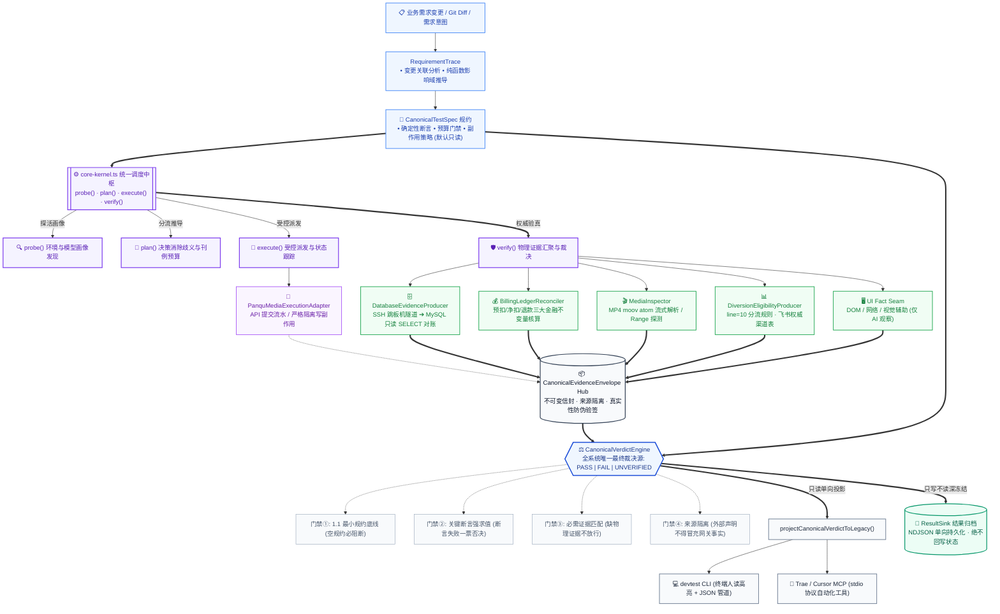
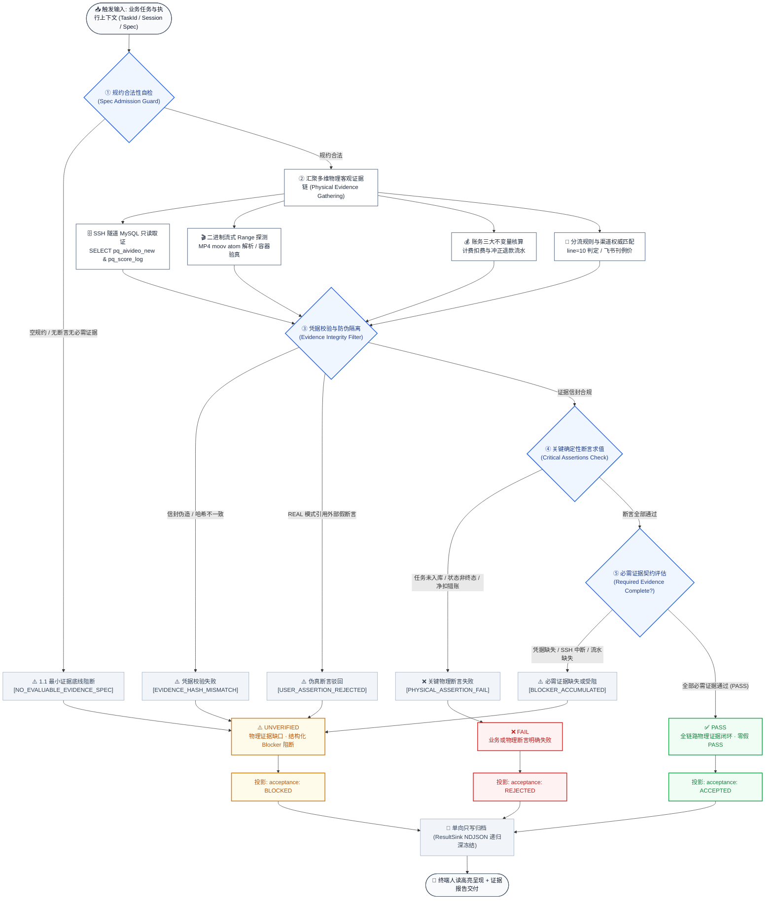
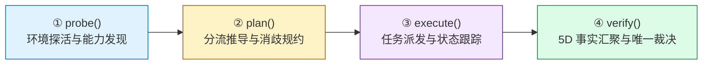
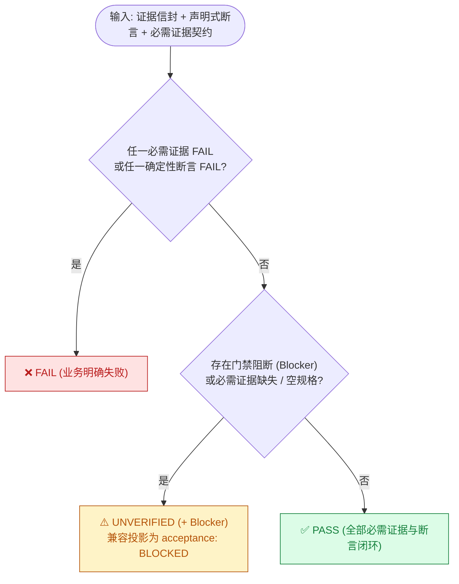

<div align="center">

# 🛡️ Panqu AI DevTest

**面向 Panqu AI 图片 / 视频生成链路的测试工程副驾 —— 意图编排、物理证据验真、零假 PASS 确定性验收门禁**

[](package.json)
[-brightgreen.svg)](tests/unit/devtest)
[%20%7C%2086.51%25%20(Stmts)-brightgreen.svg)](vitest.config.ts)
[](.github/workflows/ci.yml)
[](package.json)
[](package.json)
[-purple.svg)](docs/ARCHITECTURE_FREEZE.md)
[](docs/CLI_REFERENCE.md)

</div>

---

## 📖 定位：只测不跑 · 零假 PASS

Panqu AI DevTest 是轻量、纯净、无副作用的测试工程副驾。它负责**测试意图编排、多维物理证据链验真与全链路验收闭环**，**不承载模型训练与推理服务本身**。

> **核心业务原则：代码/需求变更 ➔ 意图编排 ➔ 物理证据与真实对账 ➔ 确定性门禁裁决（零副作用 · 零假 PASS）**

> [!IMPORTANT]
> **全系统唯一裁决权威**：全链路业务裁决统一收敛至 `CanonicalVerdictEngine` 纯三态（`PASS` \| `FAIL` \| `UNVERIFIED`）。任何领域模块、执行适配器、CLI 或 MCP 均无权自制业务通过裁决。

---

## 🏛️ 全景系统架构拓扑 (System Architecture Topology)

系统遵循严格的**单向无环数据流（Unidirectional DAG，运行时环路严格为 0）**，确立了 **“规约驱动（Spec-Driven）➔ 事实收集（Evidence Collection）➔ 唯一裁决（Canonical Verdict）➔ 投影呈现（Projection）”** 的核心管线：



---

## 🏗️ 四级架构分层规范 (4-Tier Component Boundaries)

系统代码资产严格受控于 [ARCHITECTURE_FREEZE.md](docs/ARCHITECTURE_FREEZE.md)，划分为四大层级，严禁越权渗透：

| 层级 (Tier) | 代表性组件 | 职责与生命周期 | 依赖与隔离规则 |
|---|---|---|---|
| **Tier 1: 生产调用链核心** | `canonical-protocol.ts`<br>`core-kernel.ts`<br>`canonical-verdict-engine.ts`<br>`database-evidence-producer.ts` | 承载生产环境运行的最小闭环核心；控制规约强校验、任务派发与最终裁决。 | 零外部重量级框架依赖，模块间依赖为严格无环有向图（DAG），不可引入测试桩。 |
| **Tier 2: 可选注入适配器** | `result-sink.ts`<br>`ui-adapters.ts`<br>`agent-evaluation.ts`<br>`exploration/` | 扩展性端口与纯库函数；支持单向导出、UI 契约接缝、提示词评测与自演化状态图。 | 严格遵循“四可隔离原则”（可开关、可替换、可单测、可删除），默认不污染生产调用。 |
| **Tier 3: 测试专用资产** | `TestOfflineExecutionAdapter`<br>`UIFixtureExecutionAdapter`<br>`tests/fixtures/` | 提供离线仿真、单元回归与断言契约校验。 | 严格限制在 `tests/` 目录，绝对禁止导出到 `src/`，严禁生产运行时装载。 |
| **Tier 4: 思想吸纳隔离层** | Playwright / Midscene / Promptfoo / ReportPortal / wardenIQ | 吸收业界先进理念（视觉辅助仅为 AI 观察、深冻结单向导出、Git 变更分析）。 | 坚持**纯轻量契约吸纳**，未安装外部大包（如无 playwright / @midscene 运行时），防架构虚浮膨胀。 |

---

## 🔄 核心数据流与裁决状态机 (Data Flow & Verdict State Machine)

每次验证严格按照以下状态机执行，实现物理级防作弊与 Fail-Closed 判定：



---

## 🎛️ 四大核心动作闭环



- **`probe()`**：环境连通、脱敏凭证有效性感知与模型白名单探测。无裁决权。（`--mock` 为离线仿真，人读报告标注 `[MOCK]`）
- **`plan()`**：Direct 直连 vs NewAPI 分流决策、目标对象消歧、刊例积分预算（标为 `DEVTEST_EXPECTATION`）。无裁决权。
- **`execute()`**：受控离线仿真（`mock`）与真实提交（`real`）。真实提交默认 `READ_ONLY` 预检阻断，需显式 `--allow-submit` / `--allow-paid` 授权。
- **`verify()`**：采集 5 维客观事实（Task 终态、产物归属、容器物理结构、账单流水、金融不变量），提交唯一裁决引擎终审。使用 `--wait` 可从 `execute` 自动桥接至 `verify` 一键闭环。

---

## ⚖️ 零假 PASS 裁决门禁（确定性 Fail-Closed）



> [!CAUTION]
> **最小证据契约红线**：TestSpec 必须至少声明 `requiredEvidence` 或 `deterministicAssertions` 之一；两者皆空时裁决引擎直接返回 `UNVERIFIED`（blocker `NO_EVALUABLE_EVIDENCE_SPEC`），**严禁"空规格 PASS"**。证据 provenance 严禁从预期值反推（`PROVENANCE_DERIVED_FROM_EXPECTATION` 门禁）。真实模式下，调用者外部断言（如 `--gateway-channel-confirmed`）严禁被升级为网关事实。

---

## 🗄️ 真实数据库物理取证（原生接入 TS 流水线）

涉及真实任务派发与账目变动的场景，`verify` 在**真实模式**下会自动经 `DatabaseEvidenceProducer` 与 `db-preflight.ts` 通过 SSH 隧道（跳板机 `115.191.19.88:22`）对测试库执行**只读**物理落库取证，并将证据信封折算进唯一裁决：

- **严格只读原则**：仅执行 `SELECT` 查询，严禁执行 `INSERT` / `UPDATE` / `DELETE`；
- **凭据卫生管理**：凭据由本地 `db-credentials.json` 自动解析加载，严禁打印、记录或提交明文口令；
- **媒体源表自动消歧**：视频查询 `pq_aivideo_new`；图片按模式分别查询 `pq_aivideo_goods` / `_character` / `_scene` / `_fusion`；另核验后台调度表 `pq_volcengine_ai_task`；
- **账务严格闭环**：成功任务核对前台预扣流水 `pq_score_log` 与净扣对账；失败任务核对退款冲正流水，确保净扣积分严格归零；
- **严禁越权绕过**：真实数据变更场景强制执行数据库取证，不能被 CLI `--no-db-verify` 绕过；离线 fixture 测试方可显式跳过真实 MySQL。

> [!NOTE]
> **真实端到端闭环验证实证**：真实视频任务（Seedance 2.0 任务 `239545`）与真实图片任务（`1037`）已通过 `execute`（真实付费提交）➔ 轮询终态 ➔ 产物二进制解码 ➔ DB 只读取证 ➔ 账单流水对账，全流程跑通真实闭环。

---

## 🧩 内置技能库（Skills · agent 无关）

技能是给智能体的**领域决策指南 + 代码取证映射**，源在 `src/devtest/assets/<name>/`，构建时同步到 `dist/` 与 `.trae/skills/`，本地 CLI、Codex、Trae 共用：

| 技能 | 覆盖场景 |
|---|---|
| `panqu-newapi-diversion` | NewAPI 两级分流决策、渠道权重与降级回退（含 [`diversion-flow.md`](src/devtest/assets/panqu-newapi-diversion/references/diversion-flow.md) 真实代码端到端流程，带 `文件:行号` 取证） |
| `panqu-video-models` / `panqu-image-models` | 视频 / 图片模型接入、能力参数、任务与结果 |
| `panqu-billing` | 计费扣费、积分预估、账单大盘与对账 |
| `panqu-newapi-model-onboarding` | NewAPI 新模型接入 SOP 与排障 |
| `panqu-canvas` | 画布、工作流节点、协作与执行 |
| `devtest` | DevTest 主技能：需求澄清、计划一次确认、证据门禁、报告产出（见下方「自测报告产物」与 [`report-template.md`](src/devtest/assets/devtest/report-template.md)） |

---

## 🧾 自测报告产物（双模同源）

测试结果可输出为聊天简报或文件报告，均须对应实际执行记录；涉及业务裁决时引用唯一裁决引擎的实际结果，未产生裁决时明确说明：

- **聊天简报**（默认）：按实际场景、原始结果、证据与缺口组织，规约见 [`devtest/SKILL.md`](src/devtest/assets/devtest/SKILL.md) 第十节。
- **文件报告**（可交付）：按 [`report-template.md`](src/devtest/assets/devtest/report-template.md) 围绕实际使用场景组织覆盖、执行、专项核验和问题定位，重要异常展开预期差异、影响、证据与复现，未覆盖的风险单列。

> [!NOTE]
> **文件报告填写原则**：按场景主动检查差异、告警、证据冲突与关联回归；问题说明触发条件、影响与复现，根因假设和已确认原因分开；原始结果和证据可追溯，必需证据缺失及未覆盖风险不能省略；统计与费用按实际对象计算，不预填业务值或案例。详细规则以模板为准。

---

## 🛡️ 五重自动化安全门禁 (GitHub Actions)

| 安全层级 / Job | 扫描工具 | 目标 |
|---|---|---|
| **1. 生产依赖审计** (`security-audit`) | `npm audit --audit-level=high` | 阻断 High / Critical CVE 生产依赖 |
| **2. SAST 静态分析** (`security-sast`) | **Semgrep** (OWASP Top 10 & CWE) | 阻断注入、反序列化、不安全路径与敏感 API 误用 |
| **3. 秘钥与凭证防泄漏** (`security-secrets`) | **Gitleaks** (全历史) | 阻断 JWT / API Key / SSH 私钥 / 明文密码入库 |
| **4. 配置与容器安全** (`security-trivy`) | **Trivy** | 阻断畸变容器配置与云原生隐患 |
| **5. 开源协议合规** (`security-license`) | 自研合规审计器 | 阻断未授权传染性协议 (GPL/AGPL) 污染 |

---

## 🧪 质量门禁与测试矩阵

```bash
npm test                      # 全量 51 套件 / 906 单元测试 (100% 通过)
npx vitest run --coverage     # 覆盖率门禁 (Statements 86.51%, Lines 87.51%, Functions 91.55%, Branches 79.14%)
npm run build                 # TypeScript 编译 + 内置技能同步 (dist/ 与 .trae/skills/)
npm run lint                  # ESLint + Prettier
```

当前状态：**51 套件 / 906 用例 100% 通过，零跳过零失败**；`dependency-cycle.test.ts` 保证运行时依赖回环严格为 0。

<details>
<summary><b>📊 测试矩阵（按验证域）</b></summary>

| 验证域 | 代表套件 | 核心验证范围 |
|---|---|---|
| **核心调度 / CLI** | `core-kernel-and-cli`、`core-kernel-canonical-switch` | 四大动作、CLI 退出码、E2E 闭环状态机、10 大安全反证 |
| **唯一裁决** | `canonical-verdict-engine`、`canonical-protocol`、`canonical-shadow-comparison`、`legacy-protocol-mappers` | 纯三态断言、最小证据契约底线、证据信封校验、单向投影 |
| **分流路由** | `routing`、`routing-disambiguation`、`dynamic-plan`、`diversion-*` | Direct/NewAPI 决策、渠道消歧防伪、动态规划与刊例计算、line=10 规则 |
| **执行 / 媒体 / 账务** | `execution-ports`、`media-flow`、`media-inspector`、`billing`、`database-evidence-producer` | 受控执行端口、轮询退避、MP4/PNG 物理解析、三大金融不变量、SSH 隧道 DB 只读取证 |
| **需求 / 知识 / 能力** | `requirement-trace`、`domain-knowledge`、`knowledge-*`、`self-evolving-tester`、`capability-maturity-and-reality`、`agent-evaluation` | 需求追溯、知识召回/晋升/解耦、能力成熟度、智能体可信度评测 |
| **架构 / 契约 / 隔离 / 安全** | `architecture-convergence`、`dependency-cycle`、`public-api-contract`、`test-isolation`、`result-sink`、`security-ci`、探索变异 6 套件 | 拓扑收敛、零环依赖 (Cycle Count=0)、API 契约、故障恢复、CI 安全门禁契约 |

</details>

---

## 📚 深度文档中心

- 📐 [**架构永久冻结规范**](docs/ARCHITECTURE_FREEZE.md) — 核心拓扑、受控扩展红线与不可变原则
- 💻 [**命令行参考手册**](docs/CLI_REFERENCE.md) — 四大动作完整参数、示例与 JSON 管道
- 🤖 [**MCP 集成指南**](docs/MCP_GUIDE.md) — Trae / Cursor 配置与闭环交互
- 🔍 [**验真与金融对账白皮书**](docs/VERIFICATION_SPEC.md) — MP4 Box 解构、尾部切片、三大金融不变量
- 🔀 [**NewAPI 分流真实代码流程**](src/devtest/assets/panqu-newapi-diversion/references/diversion-flow.md) — 主站分流端到端取证映射
- 🧾 [**文件报告默认模板**](src/devtest/assets/devtest/report-template.md) — 按实际执行组织结论、证据与缺口
